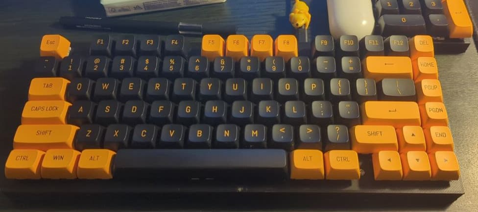

# keyboard-pcb

A compendium of project about DIY keyboards base on STM32 chips.

> The gerber files are provided and you can use it to replicate the keyboard.

> Also the 3D model for the keyboard is provided in the repository.

## Keyboard Alphanum

This is the first keyboard I made. I decided to get an easy option where I can start my incursion on this work of keyboards.
This keyboard could be used as a USB Hub and is a fun project to be made.

## Keyboard Personal

This is a version of 75% keyboard (with some variations).

## Keyboard Split

tbd

